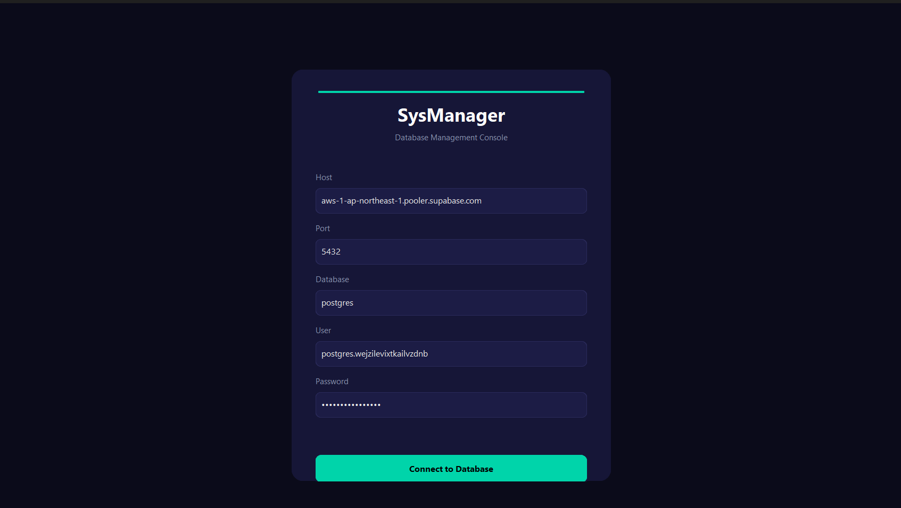
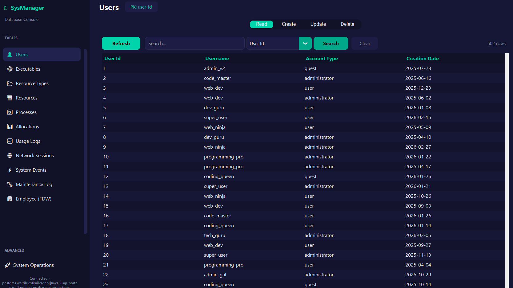
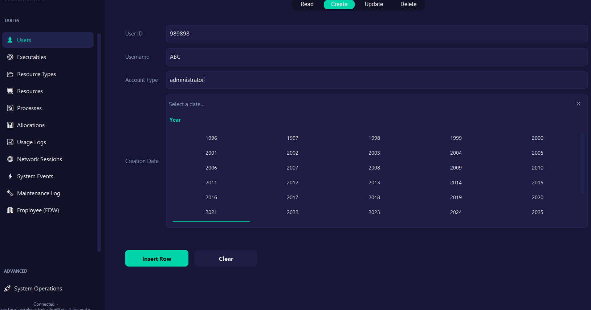
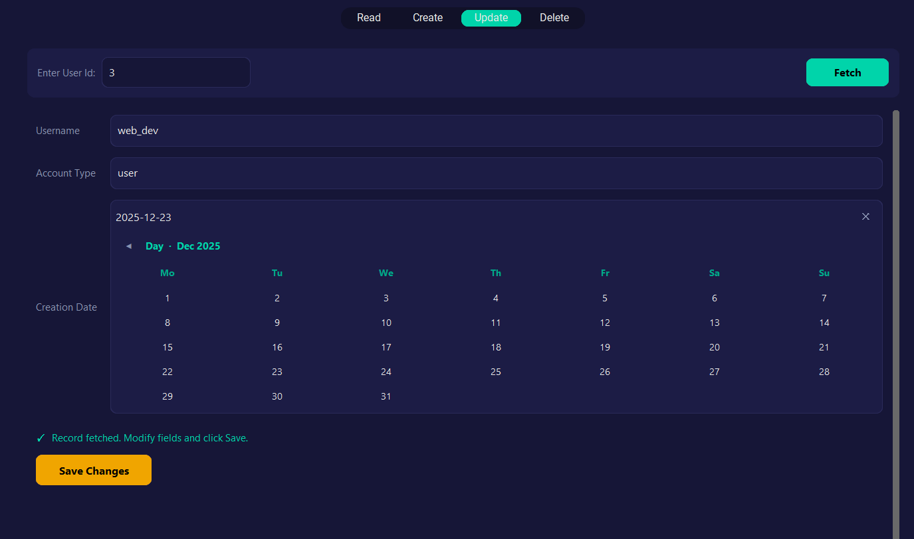
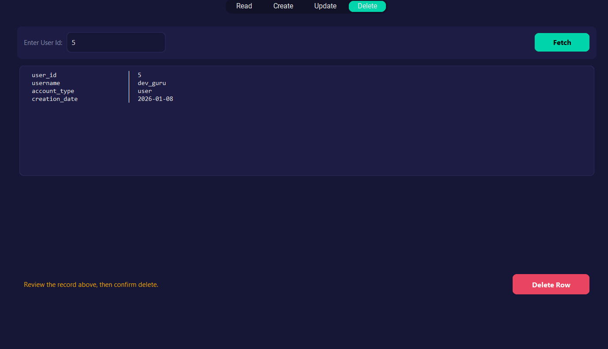
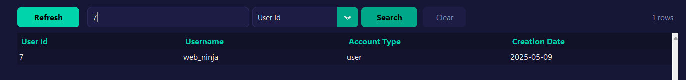
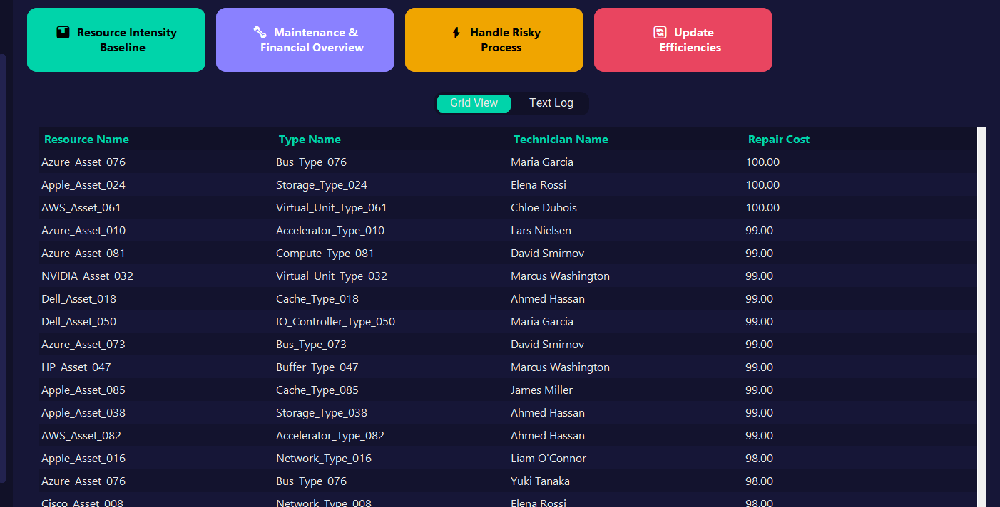
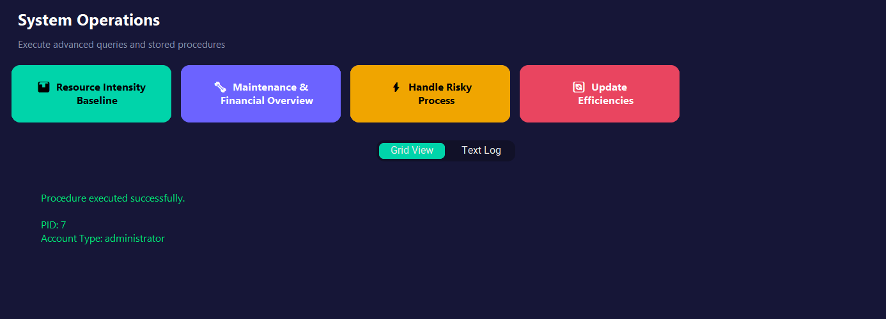

# SysManager

**A custom desktop database management client for PostgreSQL on Supabase.**

SysManager provides a polished, dark-themed interface for performing full CRUD operations on a live PostgreSQL database. It acts as a purpose-built frontend — similar to the Supabase Table Editor — with advanced features like foreign key masking, fetch-before-update workflows, and stored procedure execution.

---

## Screenshots

### Login Screen


### Dashboard – Table View (Read)


### Row Creation (Create)


### Fetch-Before-Update (Update)


### Record Deletion (Delete)


### Search & Filtering


### System Operations – Function Execution


### System Operations – Stored Procedure


---

## Features

- **Dynamic Database Connection** – Connects to a remote Supabase PostgreSQL database using credentials from `config.ini`.
- **Secure Login** – Validates credentials before granting access to the dashboard.
- **Full CRUD for All Tables** – Read, Create, Update, and Delete operations for every table in the schema (10 tables + 1 FDW table).
- **Foreign Key Masking** – Displays descriptive names (e.g., usernames, resource names) instead of raw foreign key IDs using SQL JOINs.
- **Fetch-Before-Update** – Users must fetch a record by its primary key before editing, preventing blind updates.
- **Smart Search** – Attribute-based search with exact matching for numeric fields and substring matching for text fields.
- **System Operations Dashboard** – Execute advanced SQL queries and PL/pgSQL stored procedures with a single click.
- **Clean Architecture** – Database logic (`db/`) is fully separated from UI logic (`ui/`).

---

## Tech Stack

| Component | Technology |
|---|---|
| Language | Python 3.11 |
| UI Framework | CustomTkinter |
| Database Adapter | psycopg2 |
| Database | PostgreSQL 17 (Supabase) |

---

## Project Structure

```
Part E/
├── DEVELOPMENT_WORKFLOW.md      # Development process & architecture documentation
├── INSTRUCTIONS.md              # Setup & usage guide
├── README.md                    # This file
├── images/                      # Application screenshots
└── SysManager/                  # Application source code
    ├── config.ini               # Database credentials (user-editable)
    ├── requirements.txt         # Python dependencies
    ├── main.py                  # Application entry point
    ├── db/
    │   ├── __init__.py
    │   └── connection.py        # DatabaseManager singleton
    └── ui/
        ├── __init__.py
        ├── theme.py             # Design system & dark-mode styling
        ├── table_configs.py     # Schema definitions for all 11 tables
        ├── login_screen.py      # Login screen
        ├── crud_screen.py       # Generic CRUD widget
        ├── operations_screen.py # System Operations panel
        └── dashboard.py         # Sidebar navigation & content area
```

---

## Quick Start

```bash
# 1. Navigate to the application folder
cd SysManager

# 2. Install dependencies
pip install -r requirements.txt

# 3. Edit config.ini with your Supabase credentials

# 4. Run the application
python main.py
```

For detailed instructions, see [INSTRUCTIONS.md](INSTRUCTIONS.md).

---

## Database Schema

The application manages the following tables:

| Table | Primary Key | Description |
|---|---|---|
| `users` | `user_id` | System user accounts |
| `executables` | `exe_id` | Executable binaries metadata |
| `resource_types` | `type_id` | Categories for system resources |
| `resources` | `resource_id` | Hardware/software resources |
| `processes` | `pid` | Running system processes |
| `allocations` | `alloc_id` | Resource allocations to processes |
| `usage_logs` | `log_id` | CPU and RAM usage snapshots |
| `network_sessions` | `session_id` | Network connection records |
| `system_events` | `event_id` | System event log |
| `maintenance_log` | `maint_id` | Resource maintenance records |
| `employee` (FDW) | `employee_id` | Employee data via Foreign Data Wrapper |
