# SysManager: Compute Resource Monitor
**Final Project: Phase A** **Submitted by:** Tzachi Sassoon 336347224 | Yeshurun Brama 216658831  
**Selected Unit:** Infrastructure & Operating System Monitoring

---

## Table of Contents
### SysManager - Phase A
1. [Introduction & System Definition](#1-introduction--system-definition)
2. [System UI Characterization (AI Generated)](#2-system-ui-characterization-ai-generated)
3. [Database Architecture (ERD & DSD)](#3-database-architecture-erd--dsd)
4. [Data Insertion Methods](#4-data-insertion-methods)
5. [Data Backup and Recovery](#5-data-backup-and-recovery)
### SysManager - Phase B: Database Logic & Performance Report
1. [Dual SELECT Queries (Efficiency Comparison)](#1-dual-select-queries-efficiency-comparison)
2. [Additional Independent SELECT Queries](#2-additional-independent-select-queries)
3. [Data Updates & Deletions (DML)](#3-data-updates--deletions-dml)
4. [Integrity Constraints (ALTER TABLE)](#4-integrity-constraints-alter-table)
5. [Transactions (Commit & Rollback)](#5-transactions-commit--rollback)
6. [Performance Optimization (Indexes)](#6-performance-optimization-indexes)
### SysManager - Phase C: Database Integration & Views
1. [Integration Strategy & Architecture](#1-integration-strategy--architecture)
2. [Integration Implementation (FDW)](#2-integration-implementation-fdw)
3. [System Views & Business Logic Queries](#3-system-views--business-logic-queries)
### SysManager - Phase D: Database Programming (PL/pgSQL)
1. [Table Structure Modifications (Alter Table)](#1-table-structure-modifications-alter-table)
2. [Security & Risk Analysis Mechanism (Routine 1)](#2-security--risk-analysis-mechanism-routine-1)
3. [Hardware Efficiency Calculation Mechanism (Routine 2)](#3-hardware-efficiency-calculation-mechanism-routine-2)
4. [Automated Resource Downtime Trigger (Trigger 1)](#4-automated-resource-downtime-trigger-trigger-1)
5. [Budget & Maintenance Control Trigger (Trigger 2)](#5-budget--maintenance-control-trigger-trigger-2)

---

## 1. Introduction & System Definition
SysManager is a centralized monitoring system designed for the oversight of compute resources and software processes. The system tracks real-time resource consumption (CPU/RAM), hardware maintenance, and security auditing to ensure infrastructure stability.

### Core Functionality:
* **Resource Monitoring:** Real-time tracking of hardware consumption.
* **Maintenance Management:** Recording technical repairs and infrastructure costs.
* **Security & Auditing:** Logging network sessions and critical system alerts.
* **Process Tracking:** Mapping active software to responsible users.

---

## 2. System UI Characterization (AI Generated)
The UI was characterized using the Antigravity AI Application. Below are the 4 primary screens designed for the system.


### Screen Breakdown:
* **Dashboard Overview:** High-level KPIs and health graphs.

    

* **Process Control Center:** Managing active system processes.

    

* **Hardware Monitor:** Infrastructure status and maintenance history.

    

* **Security Audit:** Log viewer for system alerts and network sessions.

    

---

## 3. Database Architecture (ERD & DSD)

### ERD (Entity Relationship Diagram)


### DSD (Data Structure Diagram)


---

## 4. Data Insertion Methods
We utilized three methods to populate the database with over 40,000 records:

1. **Manual SQL Scripts:** For core configuration data.
    
2. **CSV Import (Mockaroo):** For bulk hardware and executable data.
    
3. **Python Automation:** For generating high-volume usage and network logs.
    

---

## 5. Data Backup and Recovery

### Data Backup
The backup was performed using the `pg_dump` utility to capture the schema and data.


### Recovery & Verification
Recovery was verified by inspecting the `.sql` backup file to ensure valid data rows were exported.


---
# SysManager - Phase B: Database Logic & Performance Report

## 1. Dual SELECT Queries (Efficiency Comparison)
This section presents four pairs of queries. Each pair achieves the same result using different architectural approaches to demonstrate an understanding of SQL optimization.

### Query Pair 1: User Workload Aggregation
**Description:** Counts running processes and calculates the average size of associated executables per user.
*   **Implementation A:** Uses a **Common Table Expression (CTE)** to deduplicate and isolate active processes before aggregation.
```sql
WITH CleanUserActivity AS (
    SELECT DISTINCT u.username, p.pid, e.file_size_kb
    FROM USERS u
    JOIN PROCESSES p ON u.user_id = p.user_id
    JOIN EXECUTABLES e ON p.exe_id = e.exe_id
    WHERE p.status = 'Running'
)
SELECT 
    username, 
    COUNT(pid) AS running_processes, 
    AVG(file_size_kb) AS avg_exe_size
FROM CleanUserActivity
GROUP BY username;
```
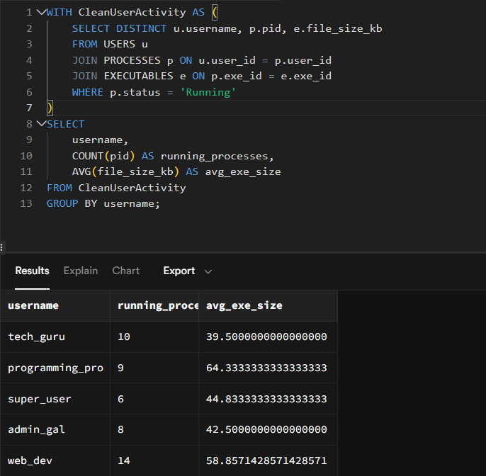
*   **Implementation B:** Uses an **inline flattened subquery** to achieve the same dataset.
```sql
SELECT 
    username,
    COUNT(DISTINCT pid) AS running_processes,
    AVG(file_size_kb) AS avg_exe_size
FROM (
    SELECT u.username, p.pid, e.file_size_kb
    FROM USERS u
    JOIN PROCESSES p ON u.user_id = p.user_id
    JOIN EXECUTABLES e ON p.exe_id = e.exe_id
    WHERE p.status = 'Running'
) AS FlattenedView
GROUP BY username;
```
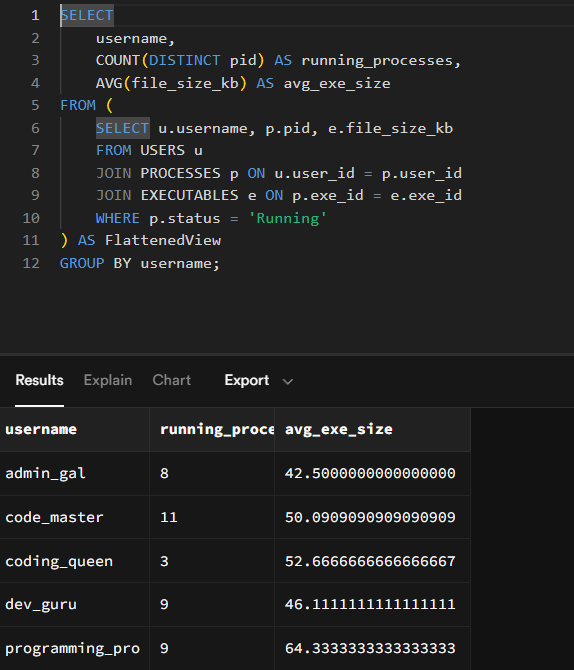
*   **Efficiency Analysis:** Implementation B is often faster in standard query optimizers as it provides a more direct execution path for the engine. However, Implementation A (CTE) offers superior readability for complex schema maintenance.

### Query Pair 2: Critical Event Filtering
**Description:** Identifies processes with multiple critical alerts that also have actively recorded usage logs.
*   **Implementation A:** Uses an **EXISTS** clause.
```sql
SELECT 
    p.process_name, 
    u.username, 
    COUNT(s.event_id) AS total_critical_events
FROM PROCESSES p
JOIN USERS u ON p.user_id = u.user_id
JOIN SYSTEM_EVENTS s ON p.pid = s.pid
WHERE s.severity = 'Critical'
  AND EXISTS (SELECT 1 FROM USAGE_LOGS l WHERE l.pid = p.pid)
GROUP BY p.process_name, u.username
HAVING COUNT(s.event_id) > 2;
```
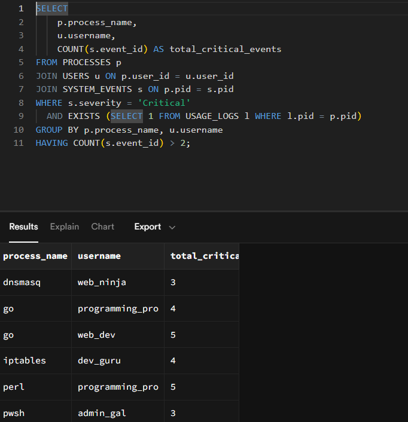
*   **Implementation B:** Uses an **IN** clause with a nested subquery.
```sql
SELECT 
    p.process_name, 
    u.username, 
    COUNT(s.event_id) AS total_critical_events
FROM PROCESSES p
JOIN USERS u ON p.user_id = u.user_id
JOIN SYSTEM_EVENTS s ON p.pid = s.pid
WHERE s.severity = 'Critical'
  AND p.pid IN (SELECT pid FROM USAGE_LOGS)
GROUP BY p.process_name, u.username
HAVING COUNT(s.event_id) > 2;
```
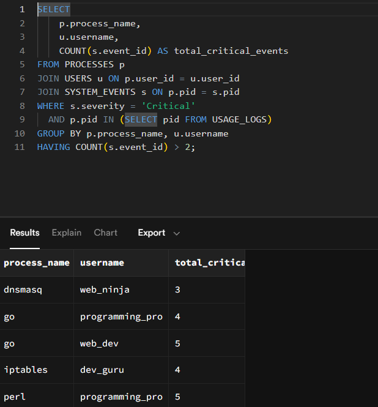
*   **Efficiency Analysis:** Implementation A (EXISTS) is significantly more efficient because it acts as a **semi-join**, meaning the database engine stops searching as soon as it finds the first match. Implementation B forces the engine to process and hold the entire list of IDs in memory before evaluation.

### Query Pair 3: Maintenance Efficiency Benchmarking
**Description:** Flags resources whose total repair costs exceed the overall average for their respective hardware categories.
*   **Implementation A:** Utilizes modern **Window Functions** to calculate category averages in a single pass.
```sql
SELECT 
    resource_name, 
    total_repair_cost, 
    category_avg
FROM (
    SELECT 
        r.resource_name,
        r.type_id,
        SUM(m.repair_cost) as total_repair_cost,
        AVG(m.repair_cost) OVER(PARTITION BY r.type_id) as category_avg
    FROM RESOURCES r
    JOIN MAINTENANCE_LOG m ON r.resource_id = m.resource_id
    GROUP BY r.resource_id, r.resource_name, r.type_id, m.repair_cost
) AS AggregatedStats
WHERE total_repair_cost > category_avg;
```
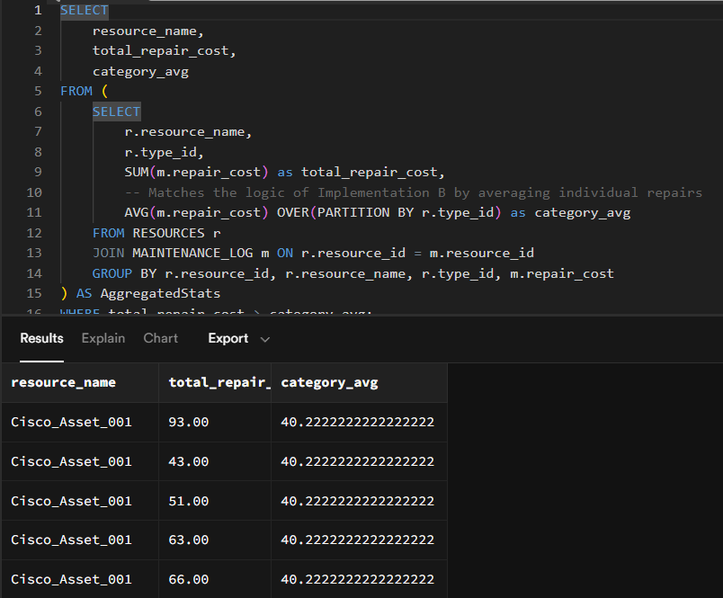
*   **Implementation B:** Relies on a **correlated subquery** within the SELECT statement.
```sql
SELECT 
    r.resource_name, 
    SUM(m.repair_cost) AS total_repair_cost,
    (SELECT AVG(m2.repair_cost) 
     FROM MAINTENANCE_LOG m2 
     JOIN RESOURCES r2 ON m2.resource_id = r2.resource_id 
     WHERE r2.type_id = r.type_id) AS category_avg
FROM RESOURCES r
JOIN MAINTENANCE_LOG m ON r.resource_id = m.resource_id
GROUP BY r.resource_id, r.resource_name, r.type_id
HAVING SUM(m.repair_cost) > (
    SELECT AVG(m3.repair_cost) 
    FROM MAINTENANCE_LOG m3 
    JOIN RESOURCES r3 ON m3.resource_id = r3.resource_id 
    WHERE r3.type_id = r.type_id
);
```
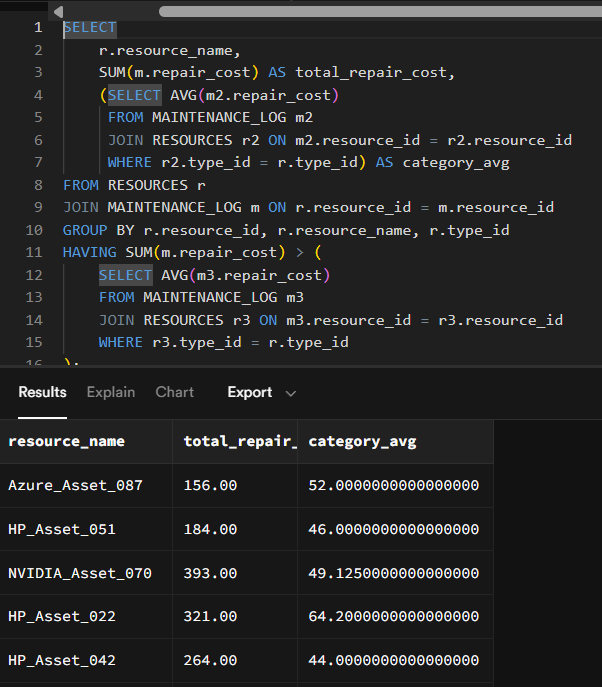
*   **Efficiency Analysis:** Implementation A is vastly more efficient. Implementation B forces the database to redundantly recalculate the category average for every single row, creating a performance bottleneck.

### Query Pair 4: Temporal Security Patterns
**Description:** Analyzes temporal patterns by grouping critical system events by year and month to identify seasonal trends.
*   **Implementation A:** This implementation uses standard SQL functional commands to extract date components and aggregates them efficiently using a grouped result set.
```sql
SELECT 
    EXTRACT(YEAR FROM p.start_time) AS event_year,
    EXTRACT(MONTH FROM p.start_time) AS event_month,
    COUNT(s.event_id) AS total_events
FROM SYSTEM_EVENTS s
JOIN PROCESSES p ON s.pid = p.pid
WHERE s.severity = 'Critical'
GROUP BY event_year, event_month
ORDER BY event_year DESC, event_month DESC;
```
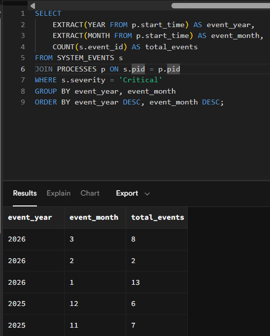
*   **Implementation B:** This implementation achieves the same result but relies on a correlated subquery within the SELECT list to count events for every row, requiring a DISTINCT clause to clean up the redundant output.
```sql
SELECT DISTINCT
    EXTRACT(YEAR FROM p.start_time) AS yr,
    EXTRACT(MONTH FROM p.start_time) AS mo,
    (SELECT COUNT(*) 
     FROM SYSTEM_EVENTS s2 
     JOIN PROCESSES p2 ON s2.pid = p2.pid
     WHERE EXTRACT(YEAR FROM p2.start_time) = EXTRACT(YEAR FROM p.start_time)
       AND EXTRACT(MONTH FROM p2.start_time) = EXTRACT(MONTH FROM p.start_time)
       AND s2.severity = 'Critical') AS total_events
FROM SYSTEM_EVENTS s
JOIN PROCESSES p ON s.pid = p.pid
WHERE s.severity = 'Critical'
ORDER BY yr DESC, mo DESC;
```
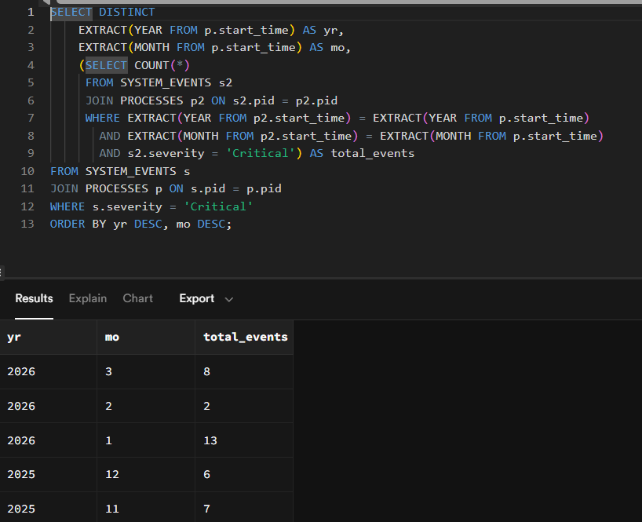
*   **Efficiency Analysis:** Implementation A uses native, hardware-optimized temporal instructions. Implementation B introduces latency by forcing the engine to perform expensive data-type conversions on every row.

---

## 2. Additional Independent SELECT Queries
These queries provide specialized, non-trivial views for the Dashboard and Security Audit modules.

### Query 5: Unified Audit Log
**Description:** Generates a unified audit log by combining system events and network sessions into one chronological view. It uses **UNION ALL** to standardize different data types and format traffic data for the security dashboard.
```sql
SELECT * FROM (
    SELECT 
        'System Event' AS category,
        p.process_name AS target,
        s.severity AS status_or_type,
        s.description AS details,
        p.start_time AS activity_time,
        CASE WHEN s.severity = 'Critical' THEN 3 WHEN s.severity = 'Warning' THEN 2 ELSE 1 END AS priority_level
    FROM SYSTEM_EVENTS s
    JOIN PROCESSES p ON s.pid = p.pid

    UNION ALL

    SELECT 
        'Network Activity' AS category,
        p.process_name AS target,
        n.protocol AS status_or_type,
        ('Dest: ' || n.dest_ip || ' | Data: ' || ROUND(n.bytes_sent/1024, 2) || ' KB') AS details,
        p.start_time AS activity_time,
        1 AS priority_level
    FROM NETWORK_SESSIONS n
    JOIN PROCESSES p ON n.pid = p.pid
) AS UnifiedLog
ORDER BY activity_time DESC
LIMIT 50;
```
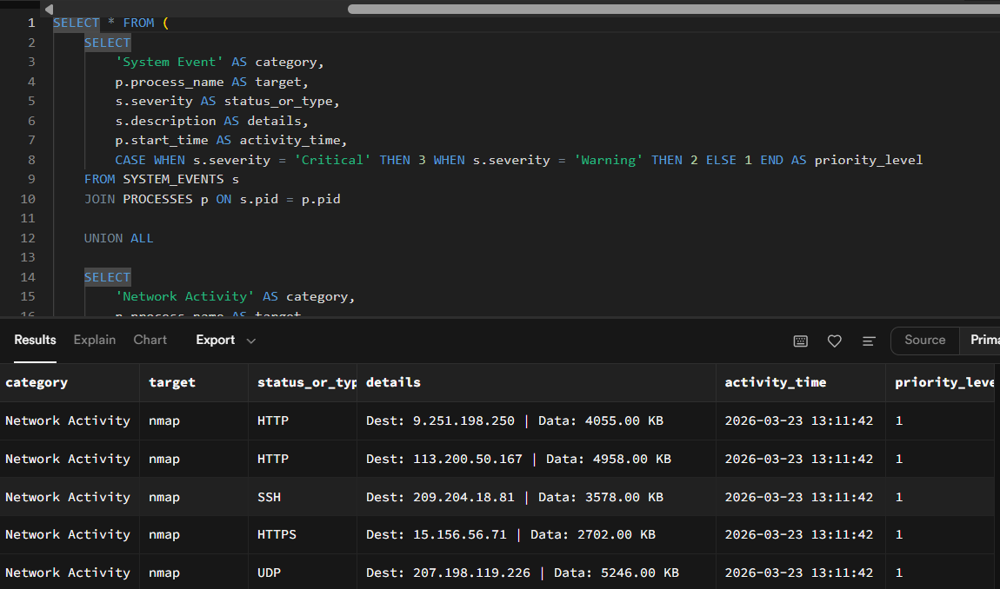

### Query 6: Resource Intensity Baseline
**Description:** Identifies processes consuming significantly more CPU than the historical average for their hardware category. This is achieved using deep joins and nested subqueries to calculate on-the-fly benchmarks.
```sql
SELECT 
    p.process_name,
    rt.type_name,
    AVG(u.cpu_percent) AS process_avg_cpu,
    (SELECT AVG(u2.cpu_percent) 
     FROM USAGE_LOGS u2
     JOIN PROCESSES p2 ON u2.pid = p2.pid
     JOIN ALLOCATIONS a2 ON p2.pid = a2.pid
     JOIN RESOURCES r2 ON a2.resource_id = r2.resource_id
     WHERE r2.type_id = rt.type_id) AS type_benchmark_avg
FROM PROCESSES p
JOIN USAGE_LOGS u ON p.pid = u.pid
JOIN ALLOCATIONS a ON p.pid = a.pid
JOIN RESOURCES r ON a.resource_id = r.resource_id
JOIN RESOURCE_TYPES rt ON r.type_id = rt.type_id
GROUP BY p.process_name, rt.type_name, rt.type_id
HAVING AVG(u.cpu_percent) > (
    SELECT AVG(u2.cpu_percent) 
    FROM USAGE_LOGS u2
    JOIN PROCESSES p2 ON u2.pid = p2.pid
    JOIN ALLOCATIONS a2 ON p2.pid = a2.pid
    JOIN RESOURCES r2 ON a2.resource_id = r2.resource_id
    WHERE r2.type_id = rt.type_id
);
```
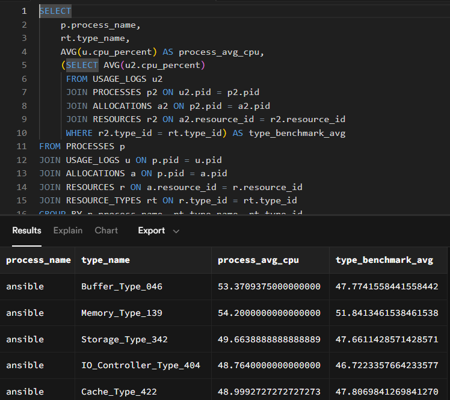

### Query 7: Critical Failure Audit Trail
**Description:** Provides a direct audit trail mapping severity alerts to specific processes and start times, ordered chronologically for security review.
```sql
SELECT 
    s.event_type,
    p.process_name,
    s.description,
    p.start_time
FROM SYSTEM_EVENTS s
JOIN PROCESSES p ON s.pid = p.pid
WHERE s.severity = 'Critical'
ORDER BY p.start_time DESC;
```
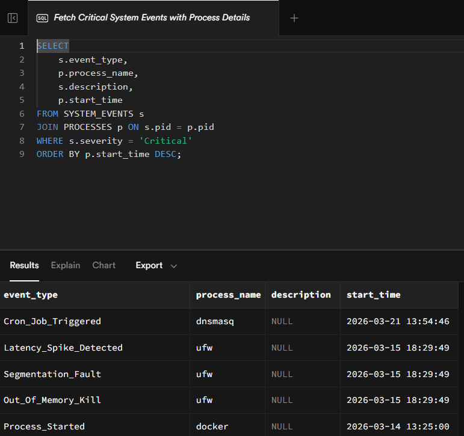

### Query 8: Maintenance & Financial Overview
**Description:** Links physical hardware status to financial repair data, displaying technician names and costs for infrastructure that is currently operational.
```sql
SELECT 
    r.resource_name,
    rt.type_name,
    m.technician_name,
    m.repair_cost
FROM RESOURCES r
JOIN MAINTENANCE_LOG m ON r.resource_id = m.resource_id
JOIN RESOURCE_TYPES rt ON r.type_id = rt.type_id
WHERE r.is_operational = TRUE
ORDER BY m.repair_cost DESC;
```
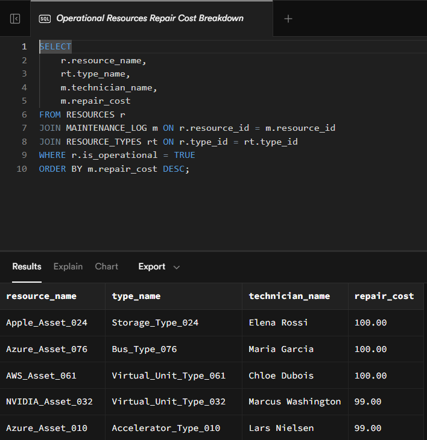

---

## 3. Data Updates & Deletions (DML)

### Update 1: Technician Rate Adjustments
**Description**: Increases repair costs by 15% for specific maintenance records associated with 'System_RAM' performed in 2026.
```sql
UPDATE MAINTENANCE_LOG
SET repair_cost = repair_cost * 1.15
WHERE technician_name = 'Lars Nielsen'
  AND EXTRACT(YEAR FROM repair_date) = 2026
  AND resource_id IN (
      SELECT r.resource_id 
      FROM RESOURCES r
      JOIN RESOURCE_TYPES rt ON r.type_id = rt.type_id
      WHERE rt.type_name = 'Accelerator_Type_001'
  );
```
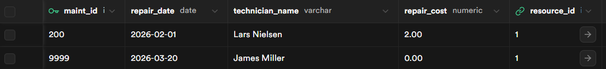
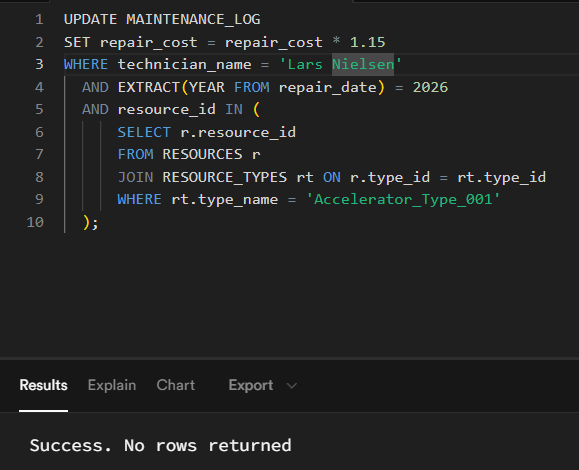


### Update 2: Logical Process Termination
**Description:** Updates process status to 'Stopped' based on parent-child hierarchy logic:
```sql
UPDATE PROCESSES
SET status = 'Stopped'
WHERE parent_pid IS NOT NULL 
  AND parent_pid IN (
      SELECT pid 
      FROM PROCESSES 
      WHERE status = 'Stopped'
  );
```
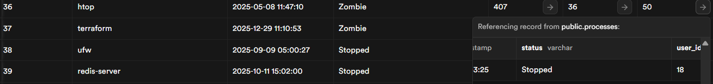
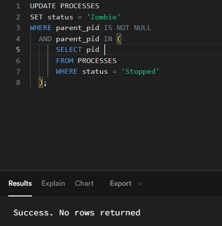
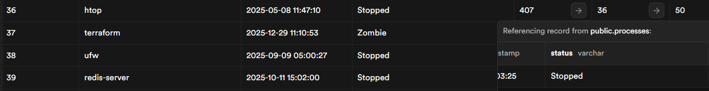

### Update 3: Security Severity Escalation
**Description**: Dynamically upgrades system events to 'Critical' if the linked process has sent more than 1GB of data in a single network session.
```sql
UPDATE SYSTEM_EVENTS
SET severity = 'Critical'
WHERE pid IN (
    SELECT pid 
    FROM NETWORK_SESSIONS 
    WHERE bytes_sent > 1073741824 -- 1GB in bytes
);
```
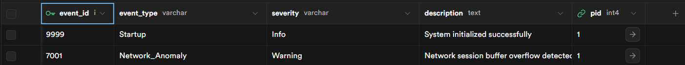
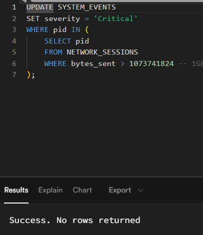


### Delete 1: Log Rotation
**Description:** Deletes stale `USAGE_LOGS` older than 30 days to optimize system storage:
```sql
DELETE FROM USAGE_LOGS
WHERE snapshot_time < CURRENT_DATE - INTERVAL '30 days'
  AND pid IN (
      SELECT pid 
      FROM PROCESSES 
      WHERE status = 'Terminated' OR status = 'Completed'
  );
```
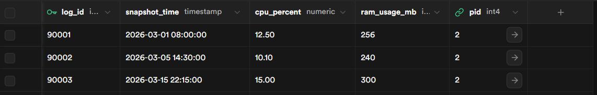
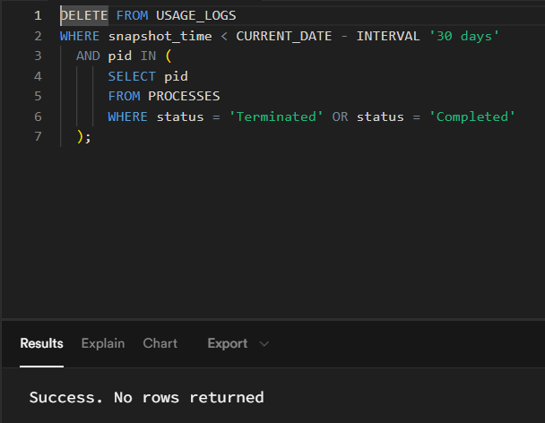
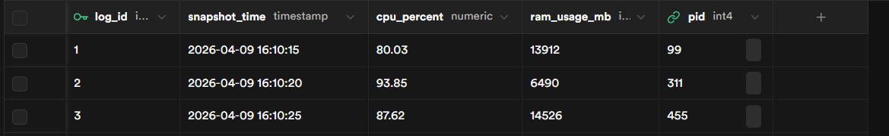

### Delete 2: Removing Low-Impact Security Noise (Security Audit)
**Description**: Removes 'Info' level events for users who have 'Developer' account types to reduce "noise" in the Unified Audit Log.
```sql
DELETE FROM SYSTEM_EVENTS
WHERE severity = 'Info'
  AND pid IN (
      SELECT p.pid 
      FROM PROCESSES p
      JOIN USERS u ON p.user_id = u.user_id
      WHERE u.account_type = 'Developer'
  );
```
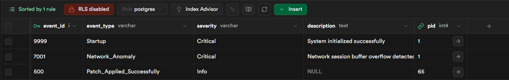
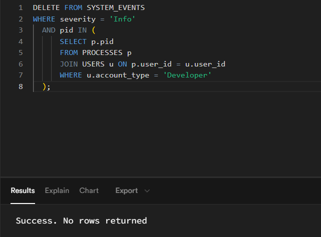
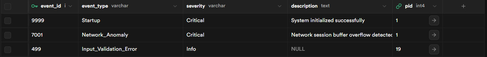

### Delete 3: Clearing Inactive Resource Allocations (Hardware Monitor)
**Description**: Removes records from the bridge table ALLOCATIONS where the associated resource is no longer operational.
```sql
DELETE FROM ALLOCATIONS
WHERE resource_id IN (
    SELECT resource_id 
    FROM RESOURCES 
    WHERE is_operational = FALSE
);
```
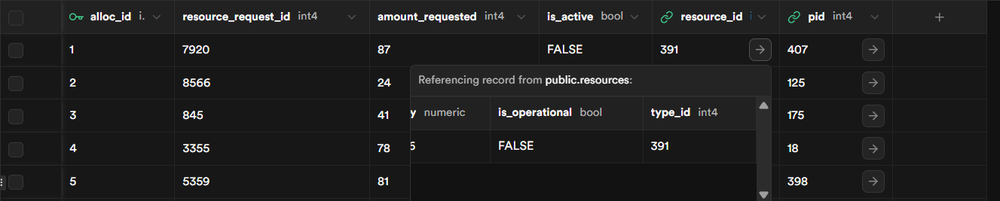
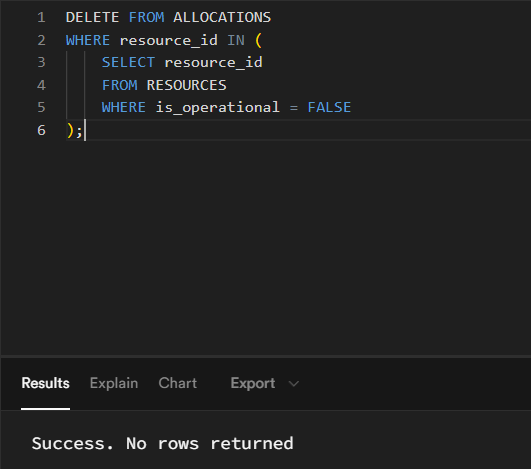
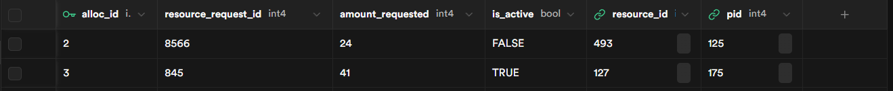
---

## 4. Integrity Constraints (ALTER TABLE)
Three constraints were added using `ALTER TABLE` to ensure "Professional-Grade" data integrity:
1.  **CPU Range Check:** Ensures `cpu_percent` is between 0 and 100.
```sql
ALTER TABLE USAGE_LOGS 
ADD CONSTRAINT check_cpu_range CHECK (cpu_percent >= 0 AND cpu_percent <= 100);
```
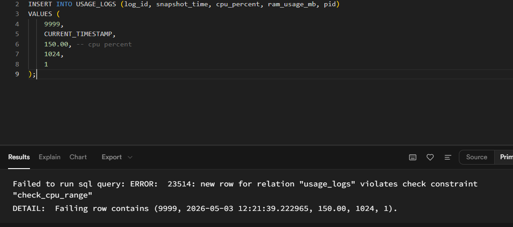
2.  **Unique Repair Constraint:** Prevents duplicate logs for the same resource, date, and technician.
```sql
ALTER TABLE MAINTENANCE_LOG 
ADD CONSTRAINT unique_repair UNIQUE (repair_date, resource_id, technician_name);
```
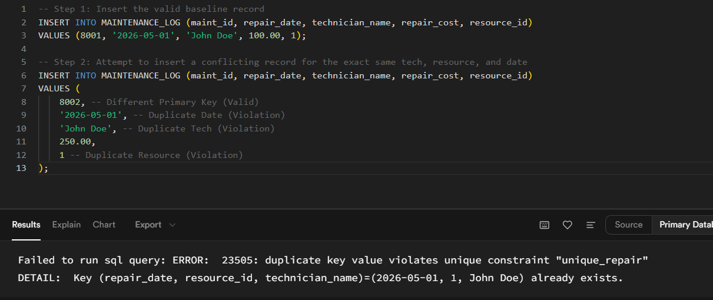
3.  **Logical Date Check:** Ensures `start_time` is never in the future.
```sql
ALTER TABLE PROCESSES 
ADD CONSTRAINT check_start_time CHECK (start_time <= CURRENT_TIMESTAMP);
```
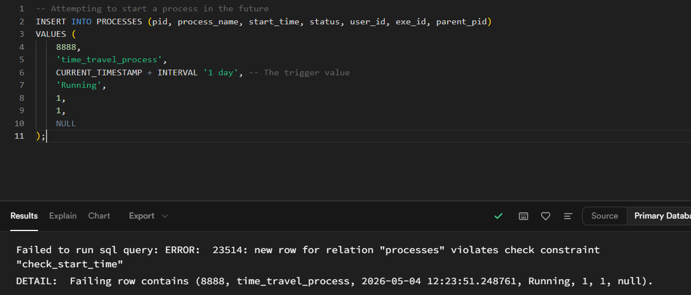

---

## 5. Transactions (Commit & Rollback)
Demonstrating **ACID** compliance within the Supabase SQL environment:
*   **Rollback:** Executing an accidental mass-update and undoing it to restore original data.
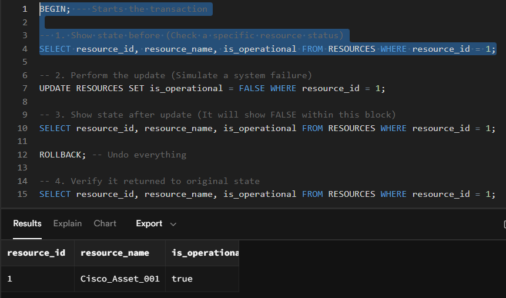
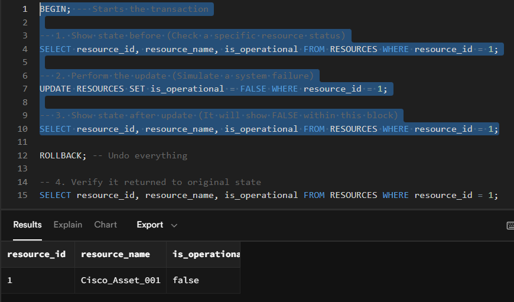
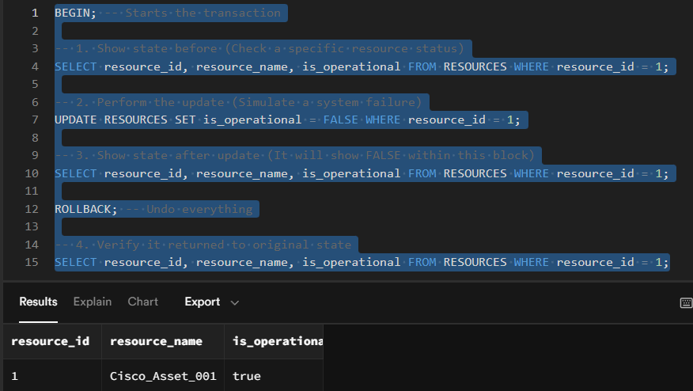
*   **Commit:** Permanently saving a verified administrative change.
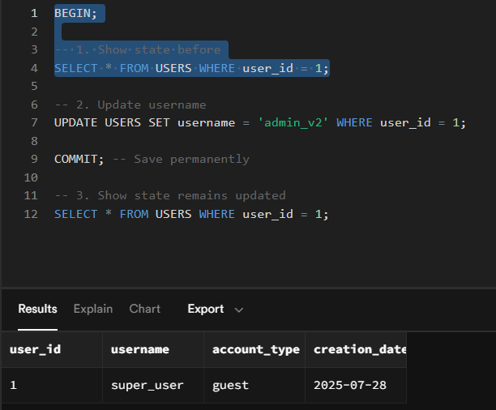
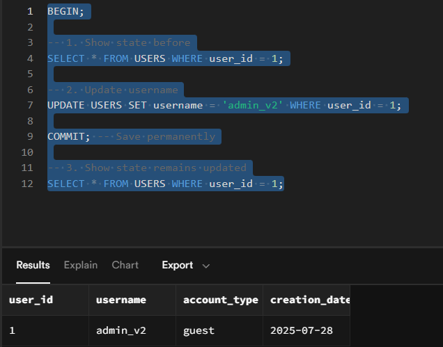

---

## 6. Performance Optimization (Indexes)
**Indexes Added:** `idx_usage_time`, `idx_cpu_status`, and `idx_net_ip`.

**Performance Justification:**
Using `EXPLAIN ANALYZE`, we observed a shift from **Sequential Scans** to **Index Scans**. This reduced query complexity from $O(n)$ to $O(\log n)$, which is essential for managing our 40,000+ monitoring records.

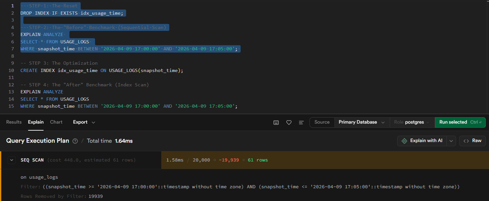
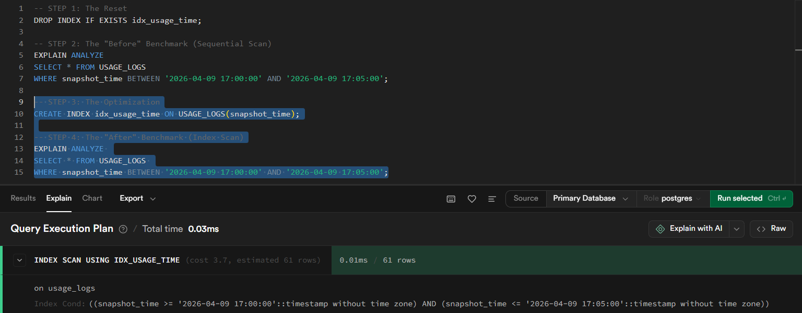
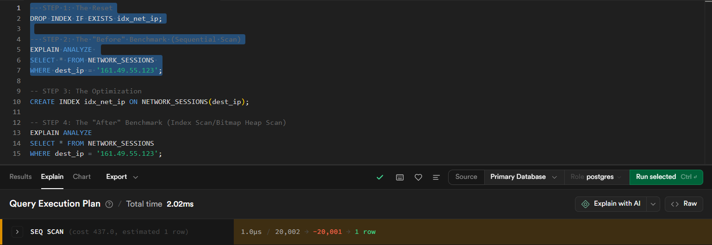
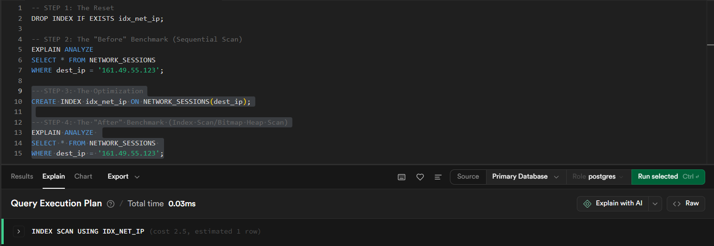
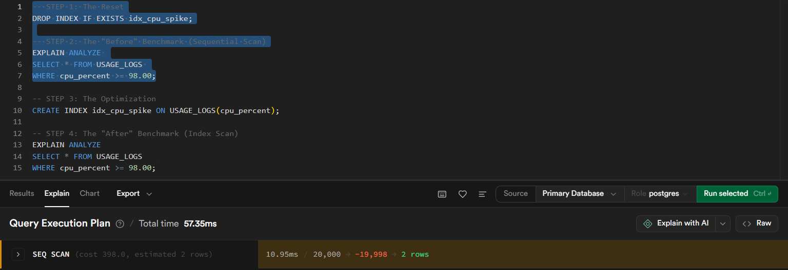
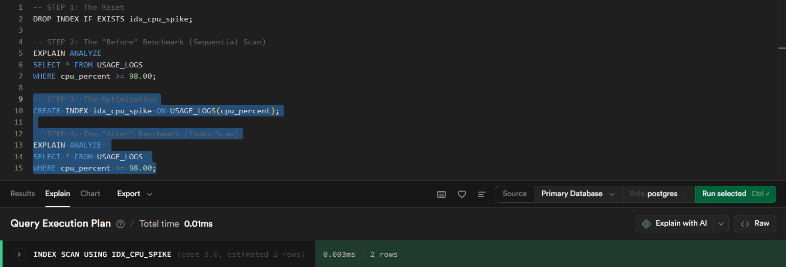

---

# SysManager - Phase C: Database Integration & Views

## 1. Integration Strategy & Architecture
For Phase C, SysManager was integrated with **GymOps** (a facility and business management system). 

To achieve a unified database without risking destructive data migrations or altering existing physical schemas, we selected **Option B: Foreign Tables**. By utilizing PostgreSQL's Foreign Data Wrapper (`postgres_fdw`), we established a virtual bridge between the systems. Specifically, we mapped `SysManager.USERS` to `GymOps.EMPLOYEE` using a 1:1 relationship, allowing us to natively track which physical staff members are utilizing the IT infrastructure.

### GymOps (Original Wing) Architecture
**GymOps ERD:**
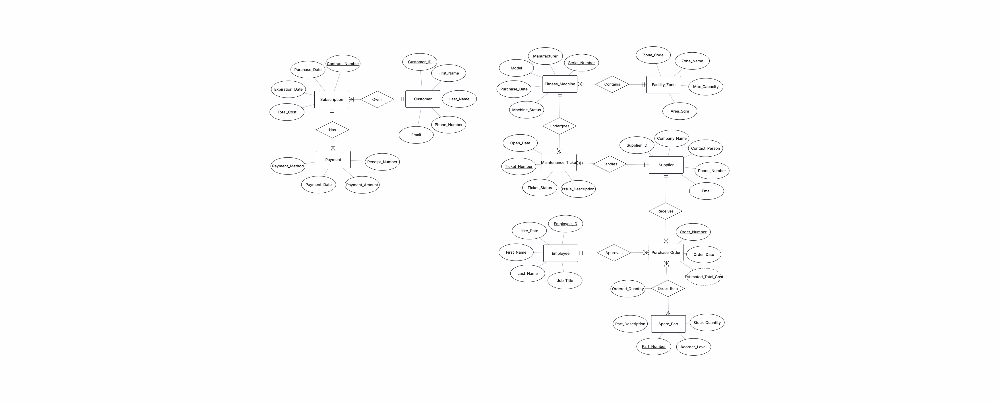

**GymOps DSD:**
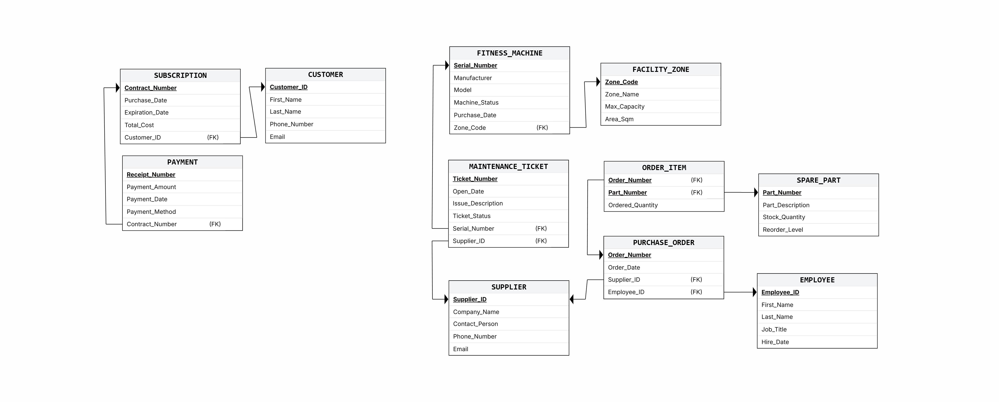

### Integrated System Architecture
**Integrated ERD (Featuring Has_Account Bridge):**
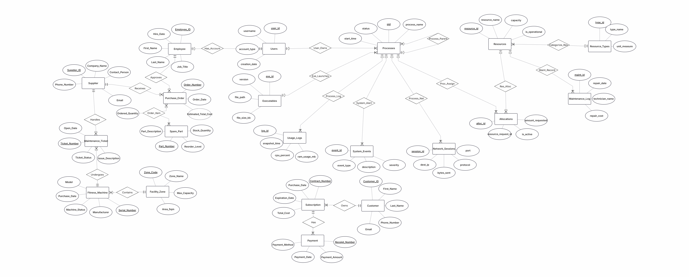

**Integrated DSD (Featuring Foreign Key Injection):**
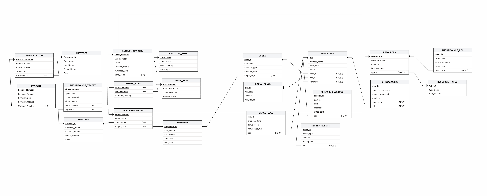

---

## 2. Integration Implementation (FDW)
The integration was executed directly in the Supabase SQL environment. We enabled the FDW extension, mapped the remote server credentials, and selectively imported the `employee` table into our public schema.

```sql
-- 1. Enable the Foreign Data Wrapper extension
CREATE EXTENSION IF NOT EXISTS postgres_fdw;

-- 2. Define the remote GymOps server 
CREATE SERVER gymops_server
FOREIGN DATA WRAPPER postgres_fdw
OPTIONS (host 'aws-0-eu-west-1.pooler.supabase.com', port '5432', dbname 'postgres');

-- 3. Set up the authentication bridge
CREATE USER MAPPING FOR current_user
SERVER gymops_server
OPTIONS (user 'postgres.dtmlqdvdqvxopncnifmr', password '********');

-- 4. Import the target table securely
IMPORT FOREIGN SCHEMA public LIMIT TO (employee)
FROM SERVER gymops_server
INTO public;
```

## 3. System Views & Business Logic Queries
To demonstrate the functional capability of the integration, we created two cross-system views (one from the perspective of each wing) and executed meaningful queries against them.

### View 1: SysManager IT Process Audit
Description: This view allows SysManager to track IT process execution back to the physical GymOps employees running them, satisfying the cross-wing integration requirement.

```sql
CREATE VIEW sysmanager_process_audit_view AS
SELECT 
    p.pid,
    p.process_name,
    u.username,
    e.first_name,
    e.last_name,
    e.job_title
FROM PROCESSES p
JOIN USERS u ON p.user_id = u.user_id
JOIN employee e ON u.user_id = e.employee_id;

SELECT * FROM sysmanager_process_audit_view LIMIT 10;
```

### Query 1.1: Management Process Filter
Description: Filters the integrated view to exclusively show active IT processes that were initiated by Gym Managers.

```sql
SELECT * FROM sysmanager_process_audit_view 
WHERE job_title = 'Gym Manager';
```

### Query 1.2: Active Process Aggregation
Description: Aggregates the integrated data to count the total number of active IT processes currently attributed to each individual employee.

```sql
SELECT first_name, last_name, COUNT(pid) as active_processes
FROM sysmanager_process_audit_view
GROUP BY first_name, last_name;
```

### View 2: GymOps HR IT Access Review
Description: This view allows GymOps HR to audit the level of IT access (account_type) their physical staff currently holds within the SysManager infrastructure.

```sql
CREATE VIEW gymops_staff_access_view AS
SELECT 
    e.employee_id,
    e.first_name,
    e.last_name,
    u.account_type,
    u.creation_date
FROM employee e
JOIN USERS u ON e.employee_id = u.user_id;

SELECT * FROM gymops_staff_access_view LIMIT 10;
```

### Query 2.1: High-Risk Access Identification
Description: Filters the HR access view to identify employees who currently hold high-risk 'Admin' privileges in the IT system.

```sql
SELECT * FROM gymops_staff_access_view 
WHERE account_type = 'Admin';
```

### Query 2.2: Account Aging Sort
Description: Sorts the employee IT access records to show the most recently created system accounts at the top.

```sql
SELECT first_name, last_name, account_type, creation_date 
FROM gymops_staff_access_view 
ORDER BY creation_date DESC;
```

---

# SysManager - Phase D: Database Programming (PL/pgSQL)

In this phase, we implemented complex business logic directly within the database using PL/pgSQL. The programs written are non-trivial and include extensive use of Implicit & Explicit Cursors, returning a Ref Cursor, Exception Handling, complex records (%ROWTYPE and RECORD), branching, and loops.

## 1. Table Structure Modifications (Alter Table)
To allow the programs to perform advanced, valuable data updates, we added two dedicated columns to the base tables:
* `risk_level` column to the `PROCESSES` table - for classifying problematic processes.
* `efficiency_score` column to the `RESOURCES` table - for rating hardware efficiency.

The changes were saved in the `AlterTable.sql` file and executed successfully:


---

## 2. Security & Risk Analysis Mechanism (Routine 1)
This mechanism scans all processes that generated abnormal system events, analyzes the account type of the user who initiated them, and automatically updates the process's risk level while logging an audited security event.

### A. Function: `get_risky_processes` (File: `func_get_risky_processes.sql`)
**Description:** The function accepts an event threshold and returns a **Ref Cursor** containing all processes that exceeded this threshold, joined with their user data.

```sql
CREATE OR REPLACE FUNCTION get_risky_processes(p_threshold INT)
RETURNS refcursor AS $$
DECLARE
    risky_cursor refcursor;
BEGIN
    OPEN risky_cursor FOR
        SELECT p.pid, p.process_name, u.account_type, COUNT(e.event_id) as event_count
        FROM PROCESSES p
        JOIN USERS u ON p.user_id = u.user_id
        JOIN SYSTEM_EVENTS e ON p.pid = e.pid
        GROUP BY p.pid, p.process_name, u.account_type
        HAVING COUNT(e.event_id) >= p_threshold;

    RETURN risky_cursor;
EXCEPTION
    WHEN OTHERS THEN
        RAISE NOTICE 'Error generating ref cursor: %', SQLERRM;
        RETURN NULL;
END;
$$ LANGUAGE plpgsql;
```

### B. Procedure: `handle_risky_process` (File: `proc_handle_risky_processes.sql`)
**Description:** The procedure receives a process ID and an account type. It uses an Implicit Cursor to fetch the process name, utilizes Branching based on security rules, and executes **DML** commands (updating the risk level and inserting a new system event with an auto-calculated running key).

```sql
CREATE OR REPLACE PROCEDURE handle_risky_process(p_pid INT, p_account_type VARCHAR)
LANGUAGE plpgsql AS $$
DECLARE
    v_process_name VARCHAR;
    v_next_event_id INT;
BEGIN
    SELECT process_name INTO v_process_name FROM PROCESSES WHERE pid = p_pid;

    IF LOWER(p_account_type) = 'administrator' THEN
        UPDATE PROCESSES SET risk_level = 'High - Admin Review Needed' WHERE pid = p_pid;
    ELSIF LOWER(p_account_type) = 'user' THEN
        UPDATE PROCESSES SET risk_level = 'Medium', status = 'Suspended' WHERE pid = p_pid;
    ELSE
        UPDATE PROCESSES SET risk_level = 'Low' WHERE pid = p_pid;
    END IF;

    SELECT COALESCE(MAX(event_id), 0) + 1 INTO v_next_event_id FROM SYSTEM_EVENTS;

    INSERT INTO SYSTEM_EVENTS (event_id, event_type, severity, description, pid)
    VALUES (v_next_event_id, 'Audit Action', 'Warning', 'Risk level updated for ' || v_process_name, p_pid);
END;
$$;
```

### C. Main Program 1 (File: `main_audit_routine.sql`)
**Description:** An anonymous block that calls the function to get the Ref Cursor, loops through the data into a dynamic **RECORD** type, and calls the procedure for each flagged process.

```sql
DO $$
DECLARE
    v_refcursor refcursor;
    v_record RECORD;
BEGIN
    v_refcursor := get_risky_processes(1);

    LOOP
        FETCH v_refcursor INTO v_record;
        EXIT WHEN NOT FOUND;
        CALL handle_risky_process(v_record.pid, v_record.account_type);
    END LOOP;

    CLOSE v_refcursor;
END;
$$;
```

### D. Execution Proof & Database Update
The main program executed without errors (Database success message):
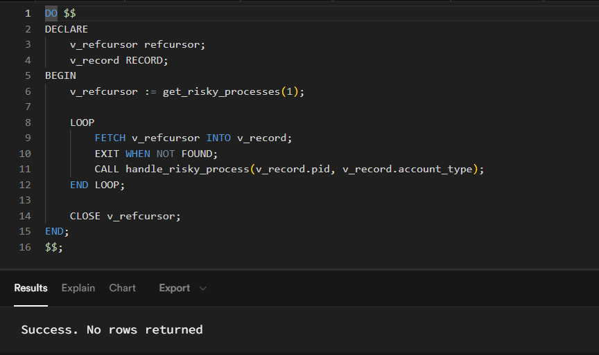

The `PROCESSES` table was successfully updated, and risk levels were calculated and populated:
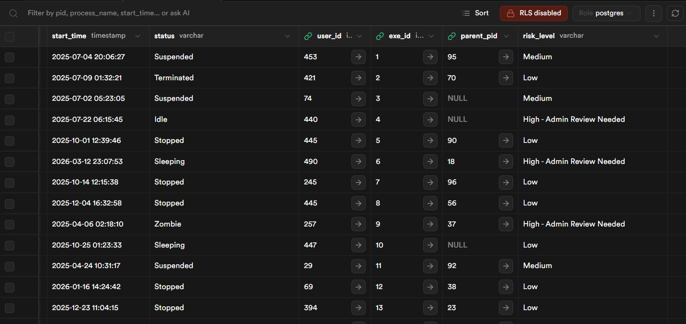

---

## 3. Hardware Efficiency Calculation Mechanism (Routine 2)
This mechanism conducts a financial and operational analysis of all active server resources in the system, calculating an efficiency score based on capacity versus maintenance costs.

### A. Function: `calc_efficiency` (File: `func_calculate_efficiency.sql`)
**Description:** Calculates the efficiency score and includes division-by-zero **Exception handling**, rounds the data to 2 decimal places, and caps the maximum score at 100.00 to maintain operational accuracy.

```sql
CREATE OR REPLACE FUNCTION calc_efficiency(p_resource_id INT)
RETURNS NUMERIC AS $$
DECLARE
    v_total_cost NUMERIC;
    v_capacity INT;
    v_score NUMERIC;
BEGIN
    SELECT SUM(repair_cost) INTO v_total_cost FROM MAINTENANCE_LOG WHERE resource_id = p_resource_id;
    SELECT capacity INTO v_capacity FROM RESOURCES WHERE resource_id = p_resource_id;

    IF v_total_cost IS NULL OR v_total_cost = 0 THEN
        v_score := 100.00;
    ELSE
        v_score := (v_capacity / v_total_cost) * 100;
    END IF;

    IF v_score > 100.00 THEN
        v_score := 100.00;
    END IF;

    RETURN ROUND(v_score, 2);
EXCEPTION
    WHEN division_by_zero THEN
        RETURN 0;
END;
$$ LANGUAGE plpgsql;
```

### B. Procedure: `update_efficiencies` (File: `proc_update_efficiencies.sql`)
**Description:** Utilizes an **Explicit Cursor** to fetch all active resources, iterates through them, and populates the data into a structured **RESOURCES%ROWTYPE** record. The function is called for each row, and the data is updated via DML.

```sql
CREATE OR REPLACE PROCEDURE update_efficiencies()
LANGUAGE plpgsql AS $$
DECLARE
    c_resources CURSOR FOR SELECT * FROM RESOURCES WHERE is_operational = TRUE;
    v_res RESOURCES%ROWTYPE;
    v_score NUMERIC;
BEGIN
    OPEN c_resources;
    LOOP
        FETCH c_resources INTO v_res;
        EXIT WHEN NOT FOUND;

        v_score := calc_efficiency(v_res.resource_id);
        UPDATE RESOURCES SET efficiency_score = v_score WHERE resource_id = v_res.resource_id;
    END LOOP;
    CLOSE c_resources;
END;
$$;
```

### C. Main Program 2 (File: `main_maintenance_routine.sql`)
**Description:** An anonymous block that triggers the system-wide update procedure and reports completion with a system notice.

```sql
DO $$
BEGIN
    CALL update_efficiencies();
    RAISE NOTICE 'Resource efficiencies recalculated successfully.';
END;
$$;
```

### D. Execution Proof & Database Update
Console output of the second main program execution:
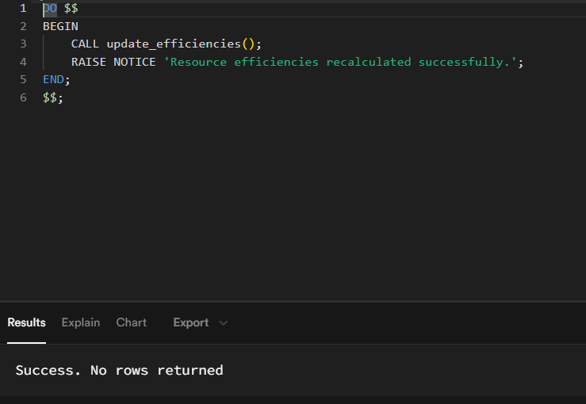

The `efficiency_score` column in the `RESOURCES` table was successfully calculated and populated:
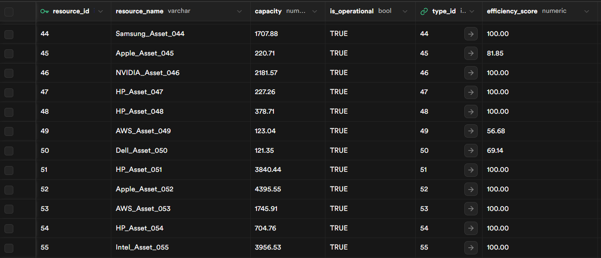

---

## 4. Automated Resource Downtime Trigger (Trigger 1)
**File:** `trig_resource_offline.sql`  
**Trigger Type:** `AFTER UPDATE`  
**Description:** This trigger listens to the `RESOURCES` table. As soon as a server's status changes from `TRUE` to `FALSE` (indicating a crash or downtime), the trigger fires automatically. It calculates a new event key, fetches a valid process ID to avoid violating NOT NULL constraints, and injects a critical 'Hardware Alert' into the system event log.

```sql
CREATE OR REPLACE FUNCTION log_resource_downtime()
RETURNS TRIGGER AS $$
DECLARE
    v_next_event_id INT;
    v_fallback_pid INT;
BEGIN
    IF OLD.is_operational = TRUE AND NEW.is_operational = FALSE THEN
        SELECT COALESCE(MAX(event_id), 0) + 1 INTO v_next_event_id FROM SYSTEM_EVENTS;
        SELECT pid INTO v_fallback_pid FROM PROCESSES LIMIT 1;

        INSERT INTO SYSTEM_EVENTS (event_id, event_type, severity, description, pid)
        VALUES (v_next_event_id, 'Hardware Alert', 'Critical', 'Resource ' || NEW.resource_name || ' unexpectedly went offline.', v_fallback_pid);
    END IF;
    RETURN NEW;
END;
$$ LANGUAGE plpgsql;

CREATE TRIGGER trg_resource_offline
AFTER UPDATE OF is_operational ON RESOURCES
FOR EACH ROW
EXECUTE FUNCTION log_resource_downtime();
```

### Trigger Execution Proof:
Executing an UPDATE command simulating a server crash:
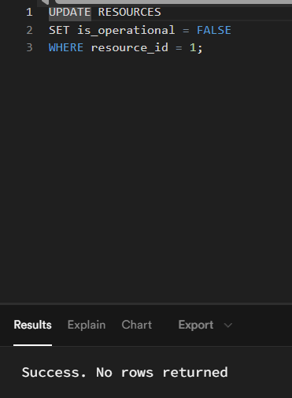

The trigger automatically generated a critical log entry in the `SYSTEM_EVENTS` table:
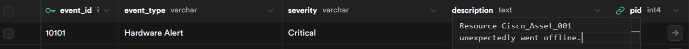

---

## 5. Budget & Maintenance Control Trigger (Trigger 2)
**File:** `trig_check_repair_cost.sql`  
**Trigger Type:** `BEFORE INSERT OR UPDATE`  
**Description:** A security trigger that prevents budget overruns in maintenance records. If a technician attempts to enter a repair cost exceeding $10,000, the trigger intercepts the action, rolls back the query, and throws a custom Exception to protect the database.

```sql
CREATE OR REPLACE FUNCTION verify_maintenance_cost()
RETURNS TRIGGER AS $$
BEGIN
    IF NEW.repair_cost > 10000 THEN
        RAISE EXCEPTION 'Repair cost % exceeds maximum allowed budget ($10,000).', NEW.repair_cost;
    END IF;
    RETURN NEW;
END;
$$ LANGUAGE plpgsql;

CREATE TRIGGER trg_check_repair_cost
BEFORE INSERT OR UPDATE ON MAINTENANCE_LOG
FOR EACH ROW
EXECUTE FUNCTION verify_maintenance_cost();
```

### Trigger Execution Proof:
Attempting to insert a $15,000 repair log resulted in the custom exception explicitly blocking the transaction:
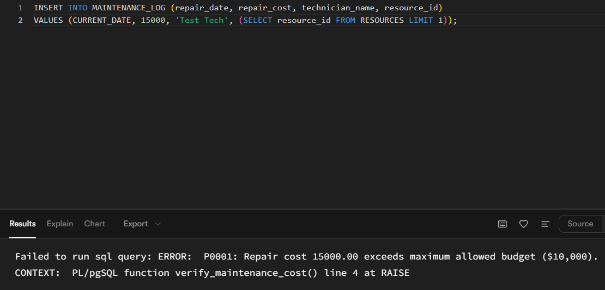