# SysManager: Compute Resource Monitor
**Final Project: Phase A** **Submitted by:** Tzachi Sassoon 336347224 | Yeshurun Brama 216658831  
**Selected Unit:** Infrastructure & Operating System Monitoring

---

## Table of Contents
1. [Introduction & System Definition](#1-introduction--system-definition)
2. [System UI Characterization (AI Generated)](#2-system-ui-characterization-ai-generated)
3. [Database Architecture (ERD & DSD)](#3-database-architecture-erd--dsd)
4. [Data Insertion Methods](#4-data-insertion-methods)
5. [Data Backup and Recovery](#5-data-backup-and-recovery)

---

## 1. Introduction & System Definition
SysManager is a centralized monitoring system designed for the oversight of compute resources and software processes. The system tracks real-time resource consumption (CPU/RAM), hardware maintenance, and security auditing to ensure infrastructure stability.

### Core Functionality:
* **Resource Monitoring:** Real-time tracking of hardware consumption.
* **Maintenance Management:** Recording technical repairs and infrastructure costs.
* **Security & Auditing:** Logging network sessions and critical system alerts.
* **Process Tracking:** Mapping active software to responsible users.

---

## 2. System UI Characterization (AI Generated)
The UI was characterized using the Antigravity AI Application. Below are the 4 primary screens designed for the system.

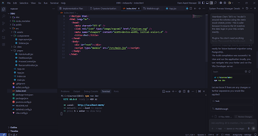

### Screen Breakdown:
* **Dashboard Overview:** High-level KPIs and health graphs.

    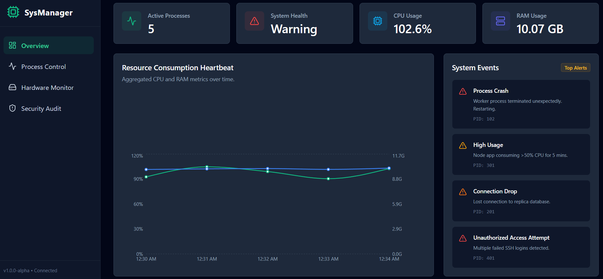

* **Process Control Center:** Managing active system processes.

    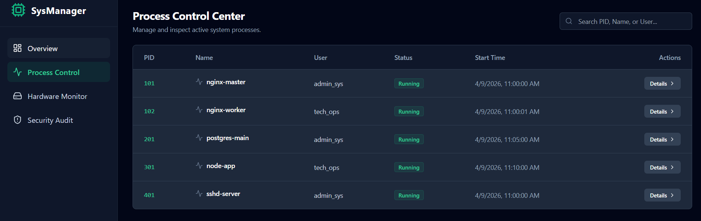

* **Hardware Monitor:** Infrastructure status and maintenance history.

    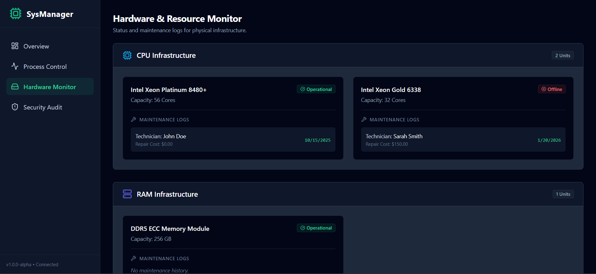

* **Security Audit:** Log viewer for system alerts and network sessions.

    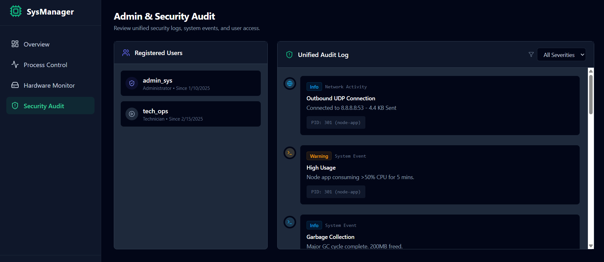

---

## 3. Database Architecture (ERD & DSD)

### ERD (Entity Relationship Diagram)
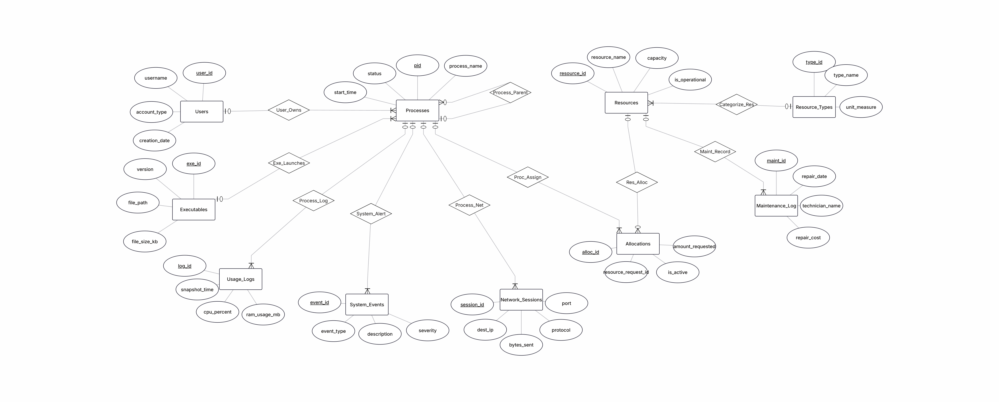

### DSD (Data Structure Diagram)
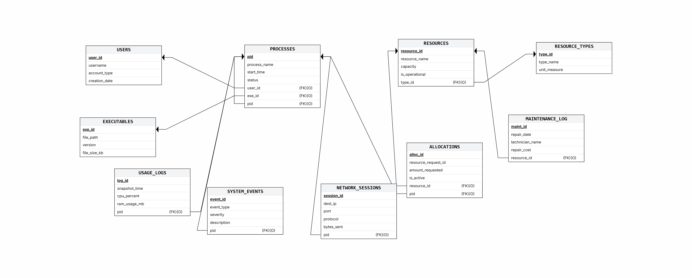

---

## 4. Data Insertion Methods
We utilized three methods to populate the database with over 40,000 records:

1. **Manual SQL Scripts:** For core configuration data.
    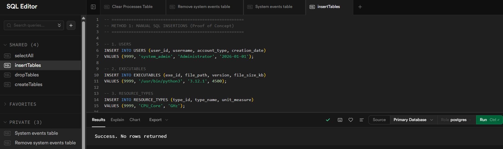
2. **CSV Import (Mockaroo):** For bulk hardware and executable data.
    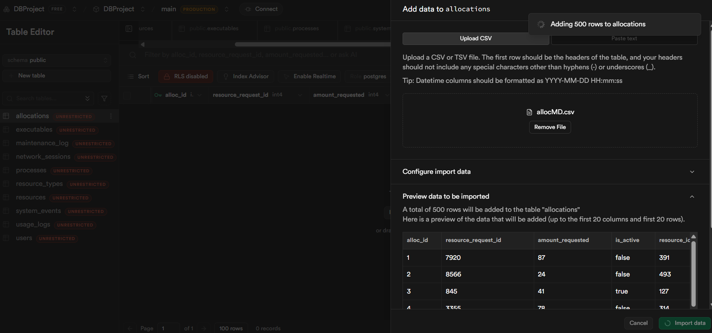
3. **Python Automation:** For generating high-volume usage and network logs.
    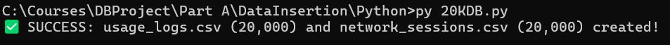

---

## 5. Data Backup and Recovery

### Data Backup
The backup was performed using the `pg_dump` utility to capture the schema and data.
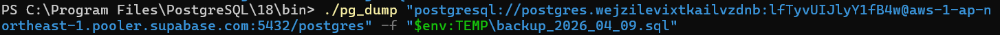

### Recovery & Verification
Recovery was verified by inspecting the `.sql` backup file to ensure valid data rows were exported.
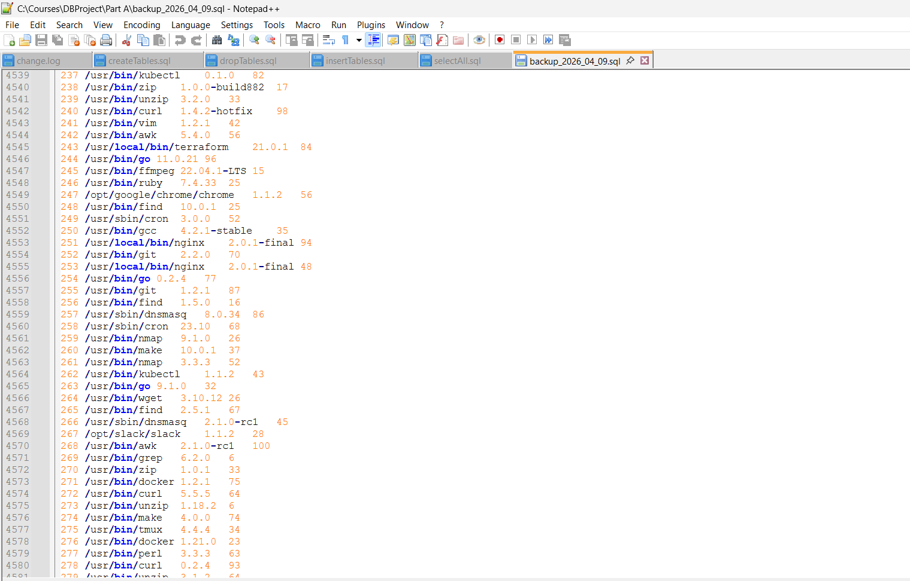